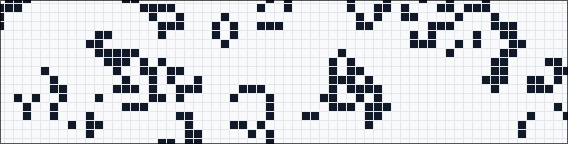

# Rust/WASM Conway's Game of Life

[](https://rvhonorato.me/game-of-life)

This project contains [Conway's Game of Life](https://en.wikipedia.org/wiki/Conway%27s_Game_of_Life) implemented in Rust and compiled to WebAssembly, frontend in React + TypeScript.

### See the **[Live demo](https://rvhonorato.me/game-of-life)**

## Overview

The simulation runs on a 64×64 toroidal grid (edges wrap around) with the standard Conway rules:

1. Live cells with 2-3 neighbors survive
2. Dead cells with exactly 3 neighbors come alive
3. Everything else dies or stays dead

The universe starts with a random configuration. You can play/pause the simulation, step through individual generations, or restart with a fresh random grid. A stats panel shows live WASM introspection data — population count, tick duration, memory usage, and raw pointer addresses.

## Architecture

```
wasm/          Rust crate (wasm-game-of-life)
├── src/
│   └── lib.rs    Universe struct, Cell enum, Conway's rules
└── pkg/          wasm-pack output (generated)

demo/          React 19 + Vite + Tailwind CSS v4 + TypeScript
└── src/
    ├── App.tsx
    └── components/
        └── Canvas.tsx   Universe lifecycle, play/pause loop, stats panel
```

The Rust code exposes an `Universe` class to JavaScript via [wasm-bindgen](https://rustwasm.github.io/docs/wasm-bindgen/). The React component initializes the WASM module asynchronously, then calls `tick()` to advance generations and `render()` to get the grid state. Additional methods (`live_count()`, `cell_bytes()`, `cells()`, `width()`, `height()`) power the stats panel.

## Running locally

You'll need Rust (stable), [wasm-pack](https://rustwasm.github.io/wasm-pack/installer/), and Node.js v20+.

```bash
git clone https://github.com/rvhonorato/game-of-life
cd game-of-life/demo
cargo install wasm-pack
rustup target add wasm32-unknown-unknown
npm install
npm run dev            # Build WASM + start Vite dev server (localhost:5173)
```

Other useful commands:

```bash
npm run build          # WASM + TypeScript check + production build
npm run build:wasm     # Rebuild just the WASM module
npm run lint           # ESLint
cd ../wasm && cargo test    # Rust unit tests
cd ../wasm && cargo clippy  # Rust lint
```

## Background

This started as a way to learn Rust and WebAssembly following the [Rust and WebAssembly tutorial](https://rustwasm.github.io/docs/book/game-of-life/introduction.html). I extended it with a React frontend, real-time WASM stats, and a visual grid renderer. See [TODO.md](./TODO.md) for ideas on where to take it next — direct memory access, bit packing, SIMD, Web Workers, and more.

## AI Disclosure

[GitHub Copilot](https://github.com/features/copilot) and [Anthropic Claude](https://claude.ai) were used for code review during the development of this project.

## License

This project is on the Public Domain ([Unlicense](./LICENSE)) - do whatever you want with it.
